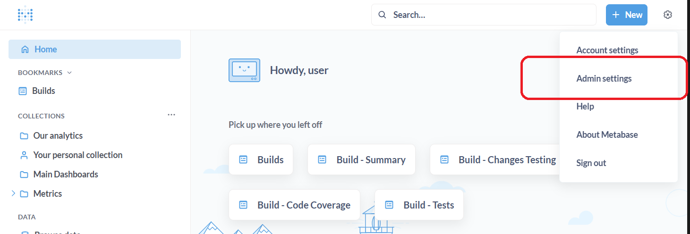
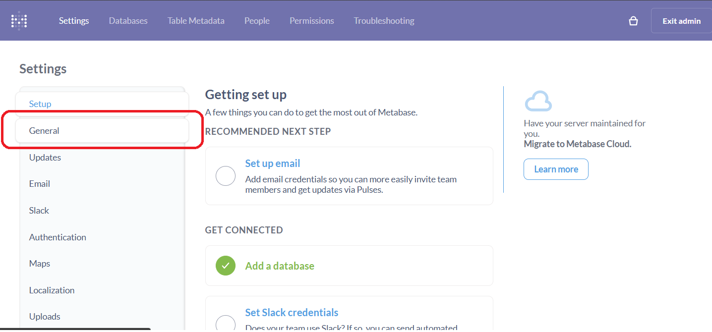
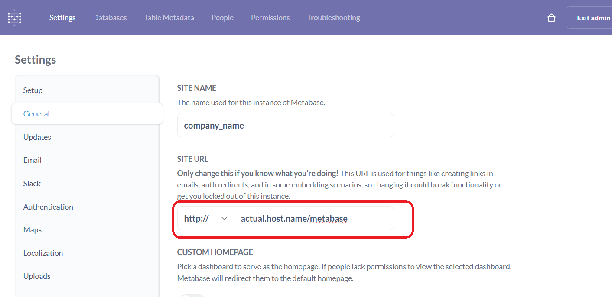
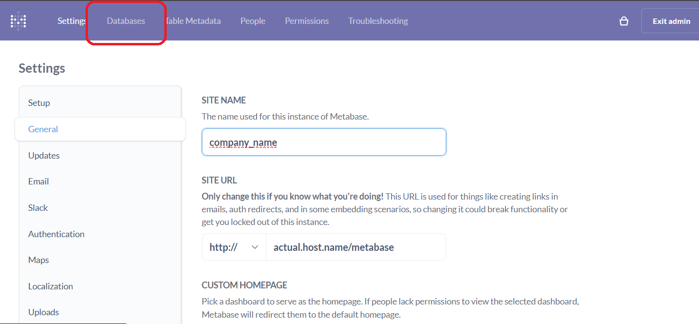
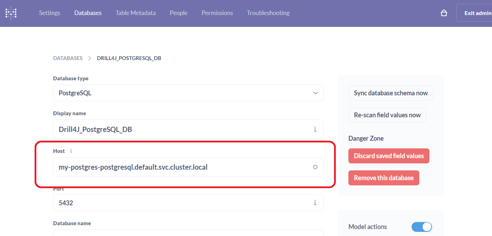
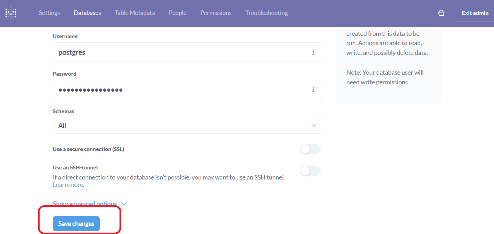

# Configuring Metabase

Open Metabase at `/metabase`. Wait for it to become available - it takes a few minutes for Metabase to start. Refresh the page until login form appears.

1. Login accordig using the following credentials.

    ```shell
        # login
        user@user.user
        # password
        useruser1
    ```

2. Open admin settings

    

3. Open general tab
    

4. Update site URL field to have the actual hostname you deployed Metabase at, followed by path `/metabase`

    

5. Open Databases tab
    
    

6. Update the following values:
    - `my-postgres-postgresql.default.svc.cluster.local`. Make sure the namespace part is correct, in case you have changed it during deployment! (in this case its `.default.`)
    - check port value to also match your PostgreSQL services configuration

    

7. Scroll down and press "Save changes"
    
    

8. Open main page of metabase (at `/metabase` path), and make sure that "Builds" link in the left sidebar opens [Builds dashboard](https://drill4j.github.io/docs/getting-started/metabase#builds-dashboard) and it loads correctly. It should display either `"No results!"` or the corresponding data. If it shows the error, you have misconfigured the Metabase dashboards.

Congratulations! You have succefully configured Metabase Dashboards to use with Drill4J data
